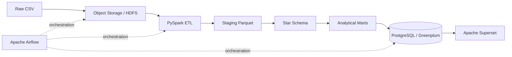
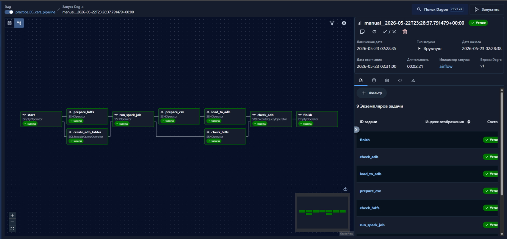
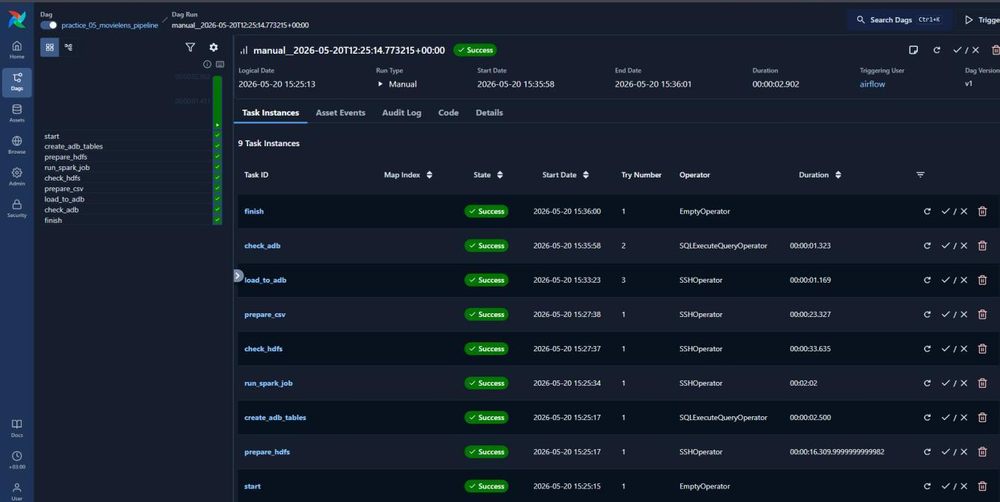
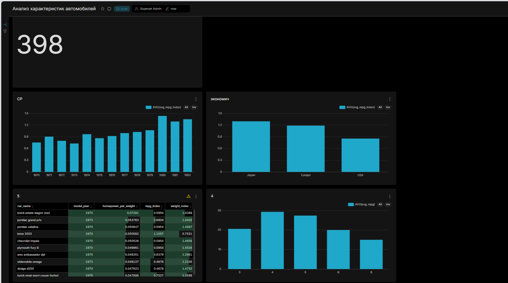

# Car Analytics Pipeline

Воспроизводимый ETL-конвейер для обработки характеристик автомобилей: от сырого CSV до модели «звезда», аналитических витрин и BI-слоя.

## Что демонстрирует проект

- оркестрацию пайплайна в Apache Airflow;
- распределённую обработку данных в PySpark;
- слои `raw -> staging -> core -> marts`;
- детерминированные surrogate keys и идемпотентную перезапись партиций;
- проверки схемы, полноты, уникальности и бизнес-ограничений;
- загрузку витрин в PostgreSQL / Greenplum;
- локальный запуск через Docker Compose;
- автоматические тесты и CI.

## Архитектура



## Результат работы

На учебном стенде пайплайн обработал 398 записей и последовательно выполнил 9 задач: подготовку HDFS, создание таблиц, запуск Spark job, формирование витрин, загрузку в Greenplum и итоговую проверку.

### Оркестрация в Airflow



Все этапы завершились со статусом `Success`.

<details>
<summary>Показать результаты выполнения задач</summary>



</details>

### Дашборд в Apache Superset



Дашборд содержит KPI общего количества автомобилей, сравнение топливной экономичности по годам и регионам, анализ по числу цилиндров и топ-10 автомобилей по отношению мощности к массе.

## Стек

`Python` `PySpark` `Apache Airflow` `PostgreSQL` `Greenplum` `HDFS` `Docker` `Apache Superset` `pytest` `GitHub Actions`

## Модель данных

- `dim_car` — автомобиль, модельный год и регион происхождения;
- `dim_origin` — справочник регионов;
- `dim_engine` — уникальная конфигурация двигателя;
- `fact_car_metrics` — исходные и нормализованные показатели автомобиля;
- `mart_avg_metrics_by_year` — динамика характеристик по годам;
- `mart_avg_metrics_by_origin` — сравнение регионов;
- `mart_avg_metrics_by_cylinders` — сравнение конфигураций двигателя;
- `mart_top_power_to_weight` — автомобили с лучшим отношением мощности к массе.

Подробная схема находится в [docs/data-model.md](docs/data-model.md).

## Быстрый запуск

Требования: Docker и Docker Compose.

```bash
cp .env.example .env
docker compose up --build -d
docker compose run --rm pipeline
```

После выполнения:

- PostgreSQL: `localhost:5432`, база `cars`, пользователь `cars`;
- Airflow: `http://localhost:8080`;
- Superset: `http://localhost:8088`, локальный вход `admin / admin`.

Для быстрой проверки без Airflow:

```bash
python -m pip install -e '.[dev]'
python jobs/cars_etl.py --input data/sample/cars.csv --output build/lake
pytest
```

## Контроль качества

Пайплайн останавливается, если:

- отсутствуют обязательные столбцы;
- ключевые поля содержат `NULL`;
- значения `origin` выходят за диапазон `1..3`;
- числовые характеристики неположительные;
- в измерениях появляются дубли ключей;
- после очистки не осталось строк.

## Структура

```text
airflow/dags/       DAG и оркестрация
data/sample/        небольшой тестовый датасет
docs/               архитектура и модель данных
jobs/               точка входа PySpark
scripts/            загрузка витрин и служебные команды
sql/                DDL и проверки PostgreSQL/Greenplum
src/car_pipeline/   преобразования и проверки качества
tests/              автоматические тесты
```

## Исходная реализация

Проект был реализован в учебном кластере Arenadata Hyperwave: CSV размещался в HDFS, обработка выполнялась Spark 3 через YARN, оркестрация — Airflow, витрины загружались в Greenplum и визуализировались в Superset. Публичная версия сохраняет эту архитектуру и добавляет воспроизводимый локальный контур.

## Автор

[Даниил Бычков](https://github.com/htlaets)
