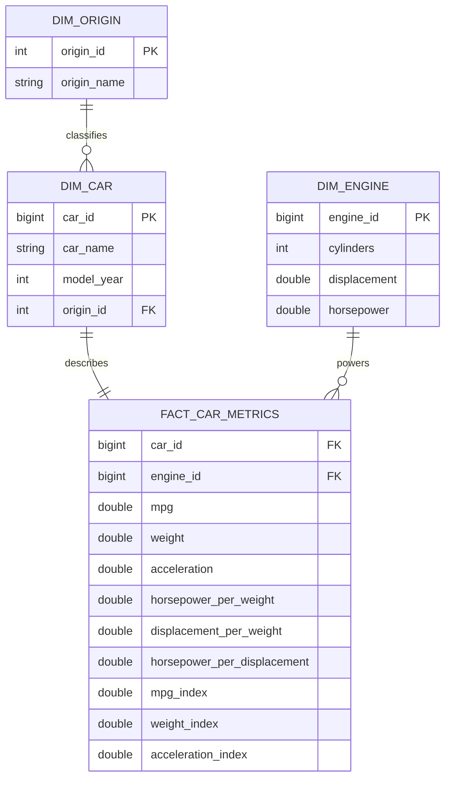

# Модель данных

## Ключи

`car_id` и `engine_id` вычисляются функцией `xxhash64` из натуральных атрибутов. В отличие от `monotonically_increasing_id`, результат не зависит от числа Spark-партиций и остаётся стабильным при повторной обработке одинакового набора данных.

## Стратегия загрузки

Учебный датасет является полным снимком, поэтому Parquet-слои атомарно перезаписываются. Витрины загружаются в транзакции `TRUNCATE + COPY`: потребитель видит либо предыдущую, либо новую полную версию данных.

Для промышленного варианта следующая итерация — хранение `source_updated_at`, watermark в Airflow и `MERGE` по детерминированному ключу.
